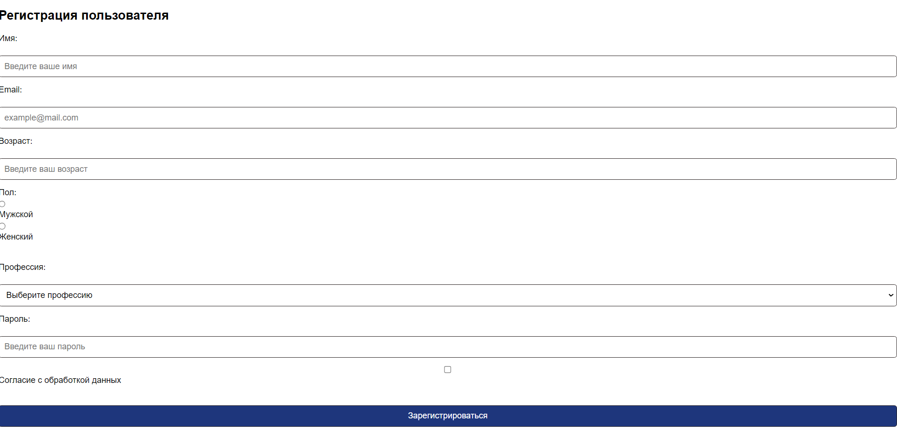
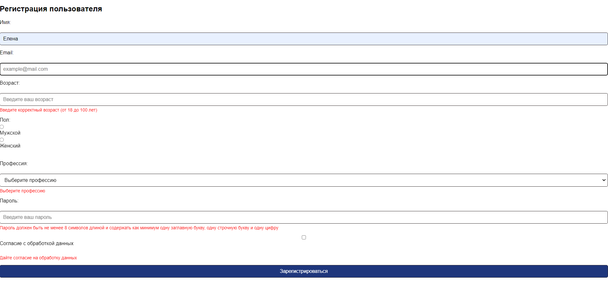

# Форма регистрации с валидацией всех полей

Создана страница с формой для регистрации пользователя, содержащая следующие поля:

Поле ввода имени: обязательное поле, должно содержать только буквы и пробелы. Длина имени должна быть от 2 до 20 символов. Имеет атрибуты placeholder и required.
Поле ввода электронной почты: обязательное поле, должно быть в формате email (содержать символ '@' и доменное имя). Имеет атрибуты placeholder и required.
Поле ввода возраста: обязательное поле. Имеет атрибуты placeholder и required.
Поле выбора пола: представленное в виде radio buttons для выбора между мужчиной и женщиной
Поле выбора профессии: обязательное поле, представленное в виде выпадающего списка (select). Имеет атрибуты required и placeholder для выбора профессии. Варианты профессий: Врач, Программист, Учитель, Дизайнер, Инженер, Продавец, Другое.
Поле ввода пароля: обязательное поле, должно быть не менее 8 символов длиной и содержать как минимум одну заглавную букву, одну строчную букву и одну цифру. Имеет атрибуты placeholder, required, minlength и pattern.
Поле checkbox, показывающее согласие пользователя с обработкой данных. Имеет атрибут required.
Кнопка отправки формы.

Используя JavaScript, добавлен обработчик события отправки формы (submit), который выполняет следующие действия:

- отменяет действие по умолчанию для события submit;
- отображает сообщение об ошибке рядом с каждым полем при обнаружении ошибки валидации;
- кнопка отправки неактивна (disabled), пока все поля формы не будут правильно заполнены и не будет отмечен чекбокс согласия с условиями;
- если форма проходит проверку валидности, вывод в консоль значения полей формы и очистка формы.

Реализованы дополнительные обработчики событий focus и blur для каждого поля.

# Технологии

  
 
   
  
  

